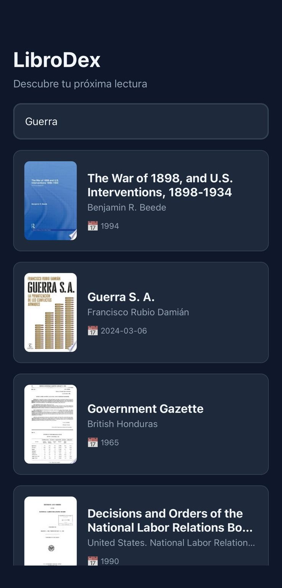

# LibroDex - App de Búsqueda de Libros

## 1. Identificación del Proyecto

- **Nombre de la App:** LibroDex
- **Asignatura/Profesor:** Desarrollo de Aplicaciones Móviles / M.C. Leonel González Vidales
- **Descripción:** Aplicación móvil para búsqueda y exploración de libros
- **Tecnología Base:** React Native con Expo
- **API Utilizada:** Google Books API
- **Fecha de Desarrollo:** Diciembre 2025
- **URL del Repositorio:** https://github.com/PedroNaim/LibroDex

## 2. Descripción del Proyecto

LibroDex es una aplicación móvil que permite a los usuarios buscar, explorar y descubrir libros utilizando la API de Google Books. La aplicación ofrece una experiencia fluida y moderna para encontrar información detallada sobre millones de libros.

### Características Principales:
- 🔍 **Búsqueda en Tiempo Real**: Búsqueda de libros con debounce para optimizar llamadas a la API
- 💡 **Sugerencias Inteligentes**: Sugerencias populares y búsquedas recientes para facilitar el descubrimiento
- 📚 **Detalles Completos**: Pantalla dedicada con información detallada de cada libro (autor, descripción, páginas, categorías, etc.)
- 🎨 **Diseño Moderno**: Interfaz con tema oscuro, gradientes y animaciones suaves
- 💾 **Historial Persistente**: Almacenamiento local de búsquedas anteriores con AsyncStorage
- ⚡ **Navegación Manual**: Sistema de navegación optimizado sin dependencias de React Navigation

### Funcionalidades Implementadas:
- Búsqueda de libros por título, autor o tema
- Visualización de resultados con portadas, títulos y metadatos
- Pantalla de detalles con información completa del libro
- Chips de sugerencias para exploración rápida
- Sistema de búsquedas recientes con límite de 20 elementos
- Navegación fluida entre pantalla de búsqueda y detalles

## 3. Tecnologías y Versiones Utilizadas

### Stack Tecnológico:
- **React Native:** 0.81.5
- **React:** 19.1.0
- **Expo:** ~54.0.29
- **React Native Safe Area Context:** ~5.6.0
- **AsyncStorage:** ^2.0.0
- **Expo Status Bar:** ~3.0.9

### APIs Externas:
- **Google Books API:** API pública sin necesidad de API key
  - Endpoint: `https://www.googleapis.com/books/v1/volumes`
  - Límite: 20 resultados por búsqueda
  - Sin autenticación requerida

### Herramientas de Desarrollo Requeridas:

- **Node.js:** v18.17.0 o superior
  ```bash
  node --version
  ```
- **NPM:** 9.0.0+ o Yarn v1.22.19+
  ```bash
  npm --version
  ```
- **Expo CLI:** v6.3.0+
  ```bash
  npx expo --version
  ```
- **Expo Go App:** Para testing en dispositivo físico
- **Android Studio:** (Opcional) v2022.3+ con Android SDK 33+ para emulador

### Verificación de Entorno:
```bash
npx expo doctor
```

## 4. Estructura del Proyecto

### Organización de Archivos:
```
LibroDex/
├── App.js                          # Componente principal con navegación manual
├── app.json                        # Configuración de Expo
├── package.json                    # Dependencias y scripts
├── index.js                        # Punto de entrada
├── assets/                         # Recursos estáticos (iconos, splash)
├── components/
│   ├── BookCard.js                 # Tarjeta individual de libro
│   ├── BookDetailModal.js          # Modal de detalles (deprecado)
│   └── SearchSuggestions.js        # Chips de sugerencias horizontales
├── screens/
│   ├── SearchScreen.js             # Pantalla principal de búsqueda
│   ├── BookDetailScreen.js         # Pantalla de detalles del libro
│   └── HistoryScreen.js            # Pantalla de historial (no implementada)
├── services/
│   ├── bookService.js              # Integración con Google Books API
│   └── storageService.js           # Gestión de AsyncStorage
└── styles/
    └── styles.js                   # Estilos centralizados y paleta de colores
```

### Arquitectura de la Aplicación:

- **App.js**: Maneja la navegación manual entre pantallas usando estado (`currentScreen`)

- **SearchScreen.js**: Pantalla principal con barra de búsqueda, sugerencias y lista de resultados

- **BookDetailScreen.js**: Pantalla completa con información detallada del libro seleccionado

- **bookService.js**: Encapsula las llamadas a Google Books API con transformación de datos

- **storageService.js**: Gestiona el almacenamiento local del historial de búsquedas

- **styles.js**: Fuente única de verdad para diseño con paleta de colores exportada

## 5. Instalación y Configuración

### Instalación de Dependencias:
```bash
# Clonar el repositorio
git clone https://github.com/PedroNaim/LibroDex
cd LibroDex

# Instalar dependencias
npm install
```

### Dependencias del Proyecto:

| Dependencia | Versión | Propósito |
|-------------|---------|-----------|
| `expo` | ~54.0.29 | Framework de desarrollo móvil |
| `react` | 19.1.0 | Biblioteca de interfaz de usuario |
| `react-native` | 0.81.5 | Framework móvil multiplataforma |
| `react-native-safe-area-context` | ~5.6.0 | Manejo de áreas seguras (notch, status bar) |
| `@react-native-async-storage/async-storage` | ^2.0.0 | Almacenamiento persistente local |
| `expo-status-bar` | ~3.0.9 | Control de barra de estado |

### Verificar instalación:
```bash
npm list --depth=0
```

## 6. API Externa (Google Books)

LibroDex utiliza la **Google Books API** pública para obtener información de libros.

### 📌 Características de la API:
- **Endpoint base**: `https://www.googleapis.com/books/v1/volumes`
- **Autenticación**: No requiere API key para búsquedas básicas
- **Límite de resultados**: 20 libros por búsqueda
- **Datos disponibles**: Título, autores, descripción, portada, categorías, páginas, ratings, etc.

### 📌 Ejemplo de búsqueda:
```javascript
const query = "JavaScript";
const url = `https://www.googleapis.com/books/v1/volumes?q=${query}&maxResults=20`;
```

### 📌 No requiere configuración adicional:
A diferencia de otras APIs, Google Books permite búsquedas públicas sin necesidad de registro o API key, lo que simplifica la configuración inicial.

## 7. Ejecución de la Aplicación

### Scripts Disponibles:
```bash
# Iniciar servidor de desarrollo
npm start
# o
npx expo start

# Limpiar caché e iniciar
npx expo start --clear

# Ejecutar en Android
npm run android

# Ejecutar en iOS (solo macOS)
npm run ios

# Ejecutar en web
npm run web
```

### Primera Ejecución:
1. **Instalar dependencias:**
   ```bash
   npm install
   ```

2. **Iniciar el servidor de desarrollo:**
   ```bash
   npm start
   ```

3. **Conectar dispositivo:**
   - **Expo Go (Recomendado):** Escanear QR code con Expo Go app
   - **Emulador Android:** Presionar `a` en la terminal
   - **Web:** Presionar `w` en la terminal

### Notas de Entorno:
- **Dispositivo físico recomendado:** La app funciona mejor en Expo Go
- **Caché:** Si hay problemas, usar `npx expo start --clear`
- **Red:** Asegurar que el dispositivo y PC estén en la misma red WiFi

## 8. Funcionalidades de la Aplicación

### Pantalla Principal - Búsqueda (SearchScreen):
- **Barra de Búsqueda**: Input con debounce de 500ms
- **Sugerencias Populares**: Chips horizontales con temas comunes (JavaScript, Python, React, etc.)
- **Búsquedas Recientes**: Últimas 5 búsquedas realizadas
- **Lista de Resultados**: Tarjetas con portada, título, autores, fecha y rating
- **Estado de Carga**: Indicador mientras se obtienen resultados
- **Estados Vacíos**: Mensajes informativos para búsquedas sin resultados

<div align="center">
  
</div>

**Características:**
- Búsqueda automática al escribir más de 3 caracteres
- Scroll infinito en resultados
- Touch sobre chips para buscar automáticamente
- Limpieza de búsqueda al borrar texto

<div align="center">
  
</div>

### Pantalla de Detalles (BookDetailScreen):
- **Portada Grande**: Imagen de 200x300px centrada
- **Información Completa**:
  - Título y autores
  - Fecha de publicación
  - Número de páginas
  - Rating promedio y número de reviews
  - Categorías
  - Descripción completa
  - Idioma original
- **Botón de Retorno**: "← Atrás" para volver a búsqueda
- **Scroll Vertical**: Para contenido extenso

<div align="center">
  
</div>

**Características:**
- Navegación suave sin React Navigation
- Preserva estado de búsqueda al regresar
- Placeholder para libros sin portada
- Diseño responsive y legible

### Características Técnicas Generales:
- **Navegación Manual**: Sistema de estado simple sin librerías externas
- **Persistencia Local**: Historial guardado en AsyncStorage
- **Optimización de Llamadas**: Debounce en búsqueda para reducir requests
- **Manejo de Errores**: Try-catch en todas las llamadas a API
- **Diseño Responsivo**: Adaptable a diferentes tamaños de pantalla
- **Tema Oscuro**: Paleta de colores moderna y consistente

## 9. Desarrollo y Extensión

### Próximas Funcionalidades Sugeridas:
- **Pantalla de Historial Completo**: Visualizar y gestionar todas las búsquedas guardadas
- **Favoritos**: Guardar libros favoritos localmente
- **Filtros Avanzados**: Por categoría, idioma, fecha de publicación
- **Compartir**: Compartir información de libros por redes sociales
- **Vista Previa**: Abrir enlace de vista previa de Google Books
- **Modo Claro**: Implementar toggle de tema oscuro/claro
- **Caché de Búsquedas**: Guardar resultados para uso offline

### Estructura para Nuevas Pantallas:
```javascript
// Ejemplo: Pantalla de Favoritos
import React from 'react';
import { View, Text } from 'react-native';
import { SafeAreaView } from 'react-native-safe-area-context';
import { styles, colors } from '../styles/styles';

const FavoritesScreen = ({ onBack }) => {
  return (
    <SafeAreaView style={styles.container}>
      <View style={styles.header}>
        <Text style={styles.title}>Mis Favoritos</Text>
      </View>
      {/* Contenido */}
    </SafeAreaView>
  );
};

export default FavoritesScreen;
```

### Agregar Nueva Pantalla a la Navegación:
1. Crear el componente en `screens/`
2. Actualizar `App.js`:
```javascript
const [currentScreen, setCurrentScreen] = useState('search');
const [screenData, setScreenData] = useState(null);

// Agregar nueva condición
{currentScreen === 'favorites' && (
  <FavoritesScreen onBack={() => setCurrentScreen('search')} />
)}
```

## 10. Troubleshooting

### Problemas Comunes:

| Problema | Solución |
|----------|----------|
| **Error al instalar dependencias** | `npm install --legacy-peer-deps` o eliminar `node_modules` y reinstalar |
| **Caché corrupto** | `npx expo start --clear` |
| **Puerto 8081 ocupado** | `npx expo start --port 8082` |
| **No se conecta al dispositivo** | Verificar que estén en la misma red WiFi |
| **Búsquedas no funcionan** | Verificar conexión a internet y acceso a googleapis.com |
| **Historial no persiste** | Verificar permisos de AsyncStorage |

### Comandos Útiles:
```bash
# Verificar entorno completo
npx expo doctor

# Limpiar caché de Metro
npx expo start --clear

# Limpiar e reinstalar dependencias
rm -rf node_modules package-lock.json
npm install

# Ver logs detallados
npx expo start --verbose

# Verificar dependencias desactualizadas
npm outdated
```

### Depuración:
```javascript
// Agregar logs en bookService.js
console.log('Búsqueda:', query);
console.log('Resultados:', data.items?.length || 0);

// Ver estado en SearchScreen.js
console.log('Books:', books.length);
console.log('Loading:', loading);
```

## 11. Generación de APK (Opcional)

### Con EAS Build:

1. **Instalar EAS CLI:**
```bash
npm install -g eas-cli
```

2. **Configurar EAS:**
```bash
eas build:configure
```

3. **Crear APK:**
```bash
eas build -p android --profile preview
```

4. **Descargar APK:**
EAS proporcionará un enlace de descarga al finalizar el build.

### Instalación en Dispositivo:
1. Transferir el archivo `.apk` al dispositivo Android
2. Habilitar "Instalar apps de fuentes desconocidas" en Configuración
3. Abrir el archivo `.apk` y seguir las instrucciones de instalación
4. La app estará disponible en el cajón de aplicaciones

## 12. Recursos y Documentación

### Documentación Oficial:
- [Expo Documentation](https://docs.expo.dev/)
- [React Native Docs](https://reactnative.dev/)
- [Google Books API](https://developers.google.com/books/docs/v1/using)
- [AsyncStorage](https://react-native-async-storage.github.io/async-storage/)

### Tutoriales y Guías:
- [Expo Getting Started](https://docs.expo.dev/get-started/installation/)
- [React Native Components](https://reactnative.dev/docs/components-and-apis)
- [SafeAreaView Guide](https://reactnavigation.org/docs/handling-safe-area/)

### Recursos de Diseño:
- [Color Palette Generator](https://coolors.co/)
- [React Native Paper](https://callstack.github.io/react-native-paper/)
- [Expo Icons](https://icons.expo.fyi/)

---

## 13. Créditos y Licencia

**Desarrollado con:**
- React Native
- Expo
- Google Books API

**Autor:** Pedro Jiménez Antúnez

**Licencia:** MIT

---

## 14. Notas Técnicas Importantes

### Arquitectura de Navegación:
Esta aplicación implementa un sistema de navegación **manual** basado en estado en lugar de usar React Navigation. Esto se debe a limitaciones encontradas durante el desarrollo con la compatibilidad de React Navigation en el entorno de Expo.

**Ventajas del enfoque actual:**
- ✅ Menor tamaño del bundle
- ✅ Sin conflictos de dependencias
- ✅ Control total sobre transiciones
- ✅ Más fácil de depurar

**Desventajas:**
- ❌ Sin animaciones nativas de transición
- ❌ Sin deep linking automático
- ❌ Gestión manual del historial de navegación

### Optimizaciones Implementadas:
1. **Debounce en Búsqueda**: Reduce llamadas innecesarias a la API
2. **Límite de Historial**: Máximo 20 búsquedas guardadas
3. **Lazy Loading**: Componentes se cargan solo cuando se necesitan
4. **Memo de Componentes**: BookCard optimizado para re-renders

---

**Versión:** 1.0.0  
**Última Actualización:** Diciembre 2024
